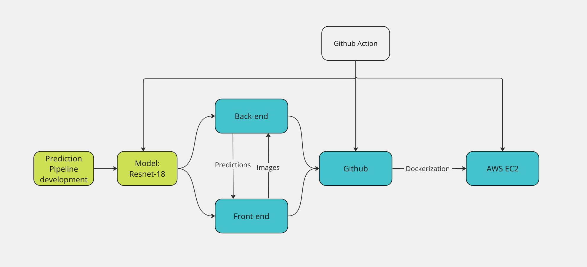
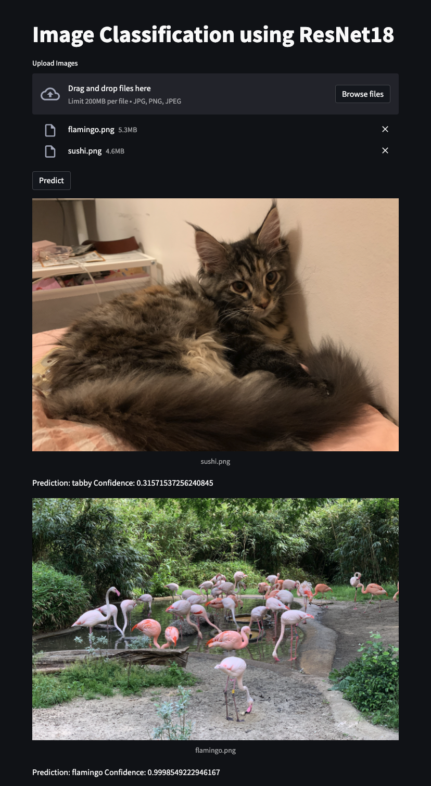

# Image Classification Web App using ResNet-18

This image classification web application is developed for educational purposes to gain hands-on experience with various DevOps tools. The following tools/frameworks are used in this project:
* Pytorch
* Docker
* Streamlit
* FastAPI
* Github Action
* AWS EC2

## Model 
The model used is a pre-trained ResNet18 model. The image preprocessing and prediction pipeline are initially implemented in a Jupyter notebook and later moved to the backend. The model supports batch prediction.

## System
Here's an overview of the system.  

 
### Front-end
The front-end is developed using Streamlit, a Python library that allows building a user interface without the need for additional HTML/CSS/JavaScript knowledge. Currently, it only supports displaying the prediction confidence of multiple given images. More features will be added in the future.

### Back-end
The back-end is developed using FastAPI, a powerful and easy-to-use web framework for building high-performance APIs with minimal effort. The model prediction pipeline is placed on the back-end side, which includes data normalization and image prediction. After receiving POST requests from the front-end side, it sends back the 10 classes with the highest probabilities (however, only the top-1 prediction is shown in the front-end).

### Deployment 
We use GitHub Actions to implement the CI/CD pipeline in this project. The app is deployed on an AWS EC2 instance. The front-end and back-end are containerized separately, and Docker Compose is used to manage the dependencies between the two containers, as well as build the images and run the containers. Below is the workflow of the CI/CD pipeline. 

### Future works
- [ ] Implement Rolling updates
 * docker stack or Kubernetes
 * Blue-gree deployment

- [ ] Optimize CI/CD pipeline
* Build images in Github Action Runner and push to container registry. Pull images from container registry on servers.
- [ ] Implement data ETL
- [ ] Data analysis and visualization on front-end

